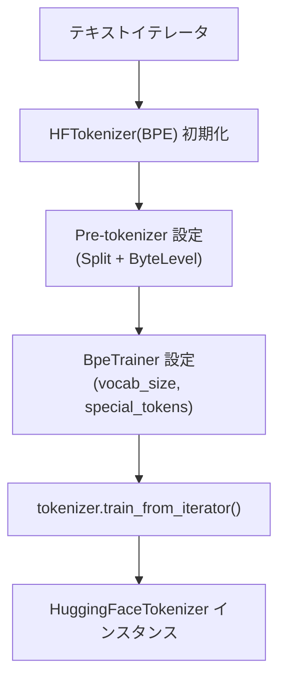
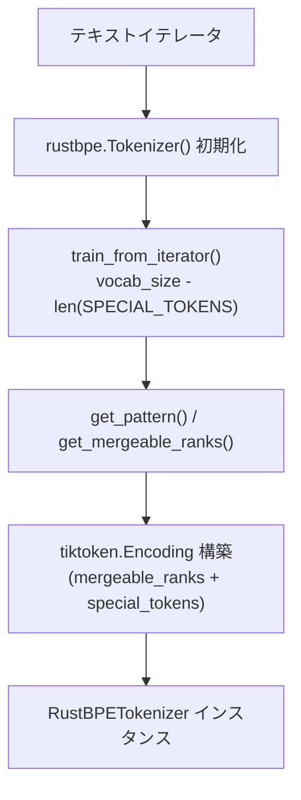
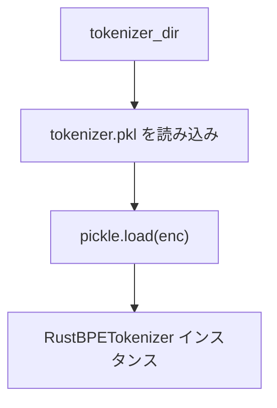
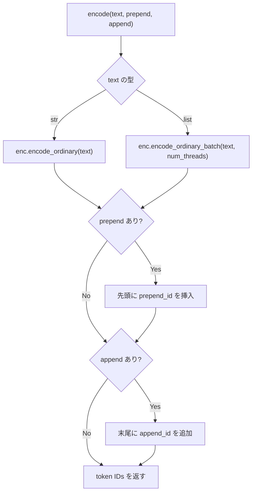
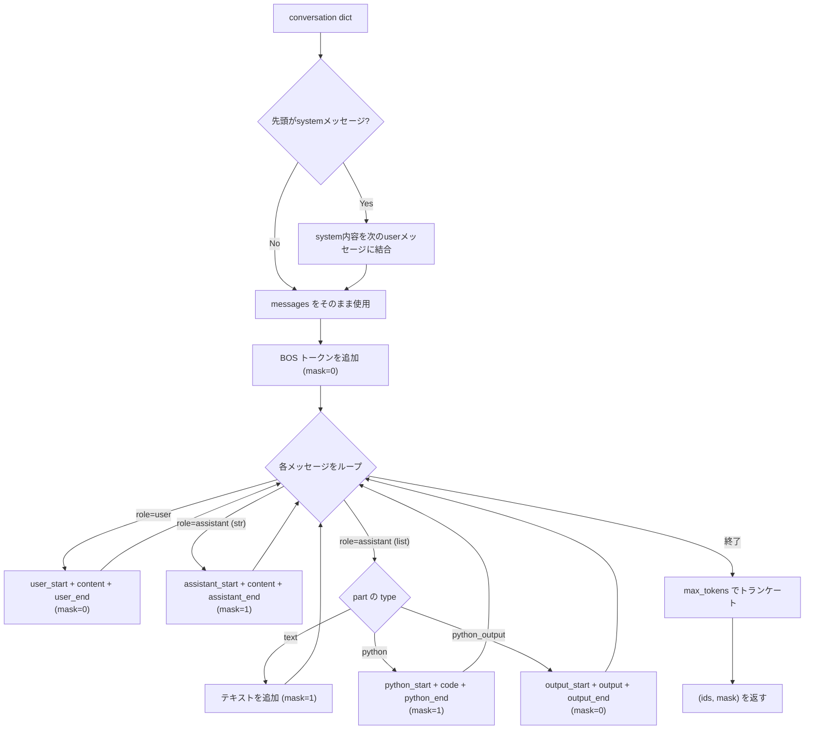
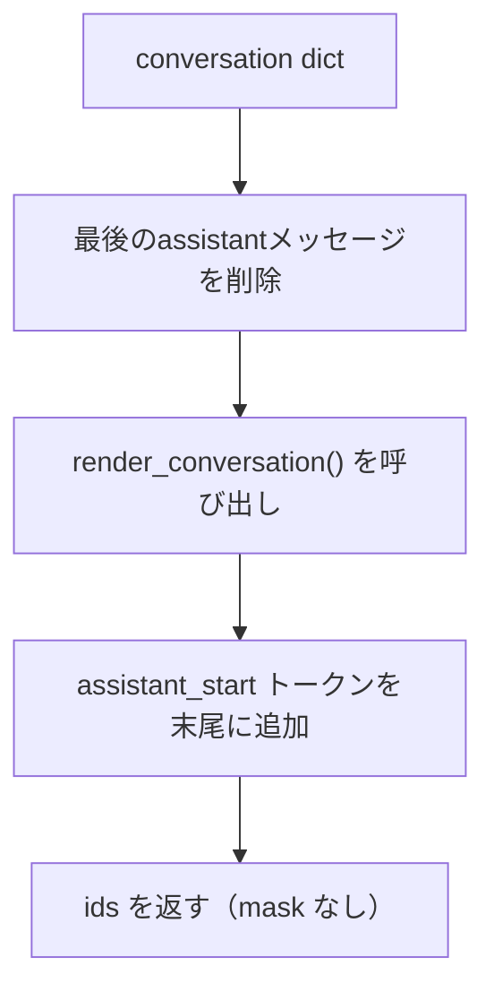
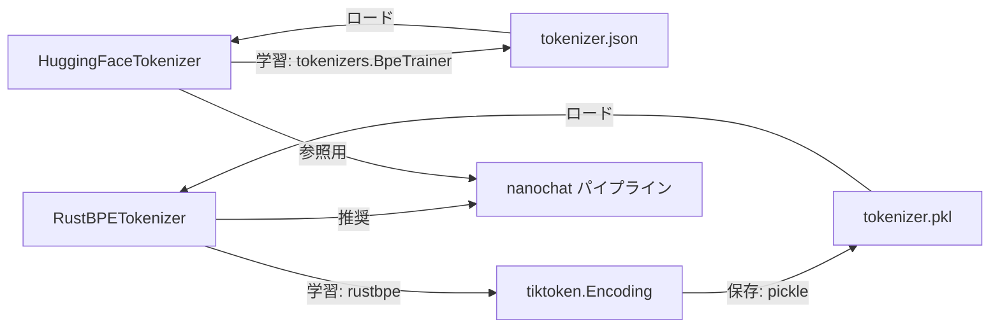

# tokenizer.py 実装解説

`nanochat/tokenizer.py` は GPT-4 スタイルの BPE (Byte Pair Encoding) トークナイザーを実装したモジュールです。  
2つの実装クラスと、チャット会話のレンダリング機能を提供します。

---

## 全体構成

```
nanochat/tokenizer.py
├── SPECIAL_TOKENS          # 特殊トークン定義
├── SPLIT_PATTERN           # 正規表現による分割パターン
├── HuggingFaceTokenizer    # HuggingFace ベースの実装（参照用）
├── RustBPETokenizer        # rustbpe + tiktoken ベースの実装（推奨）
└── get_tokenizer()         # 便利関数
```

---

## 特殊トークン

ドキュメント境界とチャット構造を表現するために、以下の特殊トークンが予約されています。

| トークン | 用途 |
|---|---|
| `<\|bos\|>` | ドキュメントの先頭（Beginning of Sequence） |
| `<\|user_start\|>` / `<\|user_end\|>` | ユーザーメッセージの区切り |
| `<\|assistant_start\|>` / `<\|assistant_end\|>` | アシスタントメッセージの区切り |
| `<\|python_start\|>` / `<\|python_end\|>` | Python REPL ツール呼び出しの区切り |
| `<\|output_start\|>` / `<\|output_end\|>` | Python REPL 出力の区切り |

---

## SPLIT_PATTERN（分割パターン）

BPE を適用する前に、テキストを意味的なチャンクに分割するための正規表現です。

```python
SPLIT_PATTERN = r"""'(?i:[sdmt]|ll|ve|re)|[^\r\n\p{L}\p{N}]?+\p{L}+|\p{N}{1,2}| ?[^\s\p{L}\p{N}]++[\r\n]*|\s*[\r\n]|\s+(?!\S)|\s+"""
```

GPT-4 の `\p{N}{1,3}` から `\p{N}{1,2}` に変更されています。  
これは語彙サイズ 32K の小規模モデルにおいて、数値トークンの無駄遣いを防ぐための最適化です。

---

## HuggingFaceTokenizer

HuggingFace `tokenizers` ライブラリのラッパーです。主に参照実装・外部モデルのロードに使用されます。

### 処理フロー（学習）



### 主要メソッド

| メソッド | 説明 |
|---|---|
| `from_pretrained(hf_path)` | HuggingFace Hub からロード |
| `from_directory(tokenizer_dir)` | ローカルの `tokenizer.json` からロード |
| `train_from_iterator(text_iterator, vocab_size)` | テキストイテレータから学習 |
| `encode(text, prepend, append)` | テキストをトークンIDリストに変換 |
| `decode(ids)` | トークンIDリストをテキストに変換 |
| `save(tokenizer_dir)` | `tokenizer.json` として保存 |

---

## RustBPETokenizer（推奨実装）

`rustbpe` で学習し、`tiktoken` で高速推論を行うハイブリッド実装です。

### 処理フロー（学習）



> 特殊トークンは学習には含めず、`tiktoken.Encoding` 構築時に末尾へ追加されます。

### 処理フロー（ロード）



### 主要メソッド

| メソッド | 説明 |
|---|---|
| `from_pretrained(tiktoken_name)` | tiktoken の既存エンコーディングからロード |
| `from_directory(tokenizer_dir)` | ローカルの `tokenizer.pkl` からロード |
| `train_from_iterator(text_iterator, vocab_size)` | rustbpe で学習し tiktoken でラップ |
| `encode(text, prepend, append, num_threads)` | 単一文字列またはリストをエンコード（バッチ並列対応） |
| `decode(ids)` | トークンIDリストをテキストに変換 |
| `save(tokenizer_dir)` | `tokenizer.pkl` として保存 |
| `render_conversation(conversation, max_tokens)` | チャット会話をトークン列に変換（SFT用） |
| `render_for_completion(conversation)` | RL用に会話をトークン列に変換 |
| `visualize_tokenization(ids, mask)` | デバッグ用カラー表示 |

---

## encode() の処理フロー



---

## render_conversation() の処理フロー

SFT（教師あり微調整）用に、チャット会話をトークン列と学習マスクに変換します。



### mask の意味

| mask 値 | 対象 | 説明 |
|---|---|---|
| `0` | BOS、ユーザーメッセージ、Python出力 | 学習対象外 |
| `1` | アシスタントの応答、Pythonコード | 学習対象（損失計算に使用） |

---

## render_for_completion() の処理フロー

RL（強化学習）用に、アシスタントの最後のメッセージを除いた状態でトークン列を生成します。



---

## 便利関数

### get_tokenizer()

```python
def get_tokenizer():
    # base_dir/tokenizer/ から RustBPETokenizer をロードして返す
    return RustBPETokenizer.from_directory(tokenizer_dir)
```

### get_token_bytes()

```python
def get_token_bytes(device="cpu"):
    # base_dir/tokenizer/token_bytes.pt を読み込む
    # 各トークンIDのUTF-8バイト長を格納したテンソル（BPB計算用）
```

`token_bytes.pt` は `scripts/tok_train.py` によって生成され、評価時の **Bits Per Byte (BPB)** 計算に使用されます。

---

## クラス間の関係


